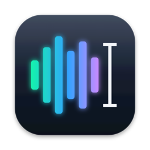
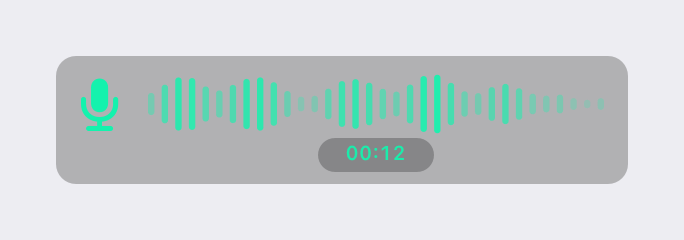
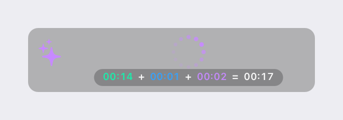
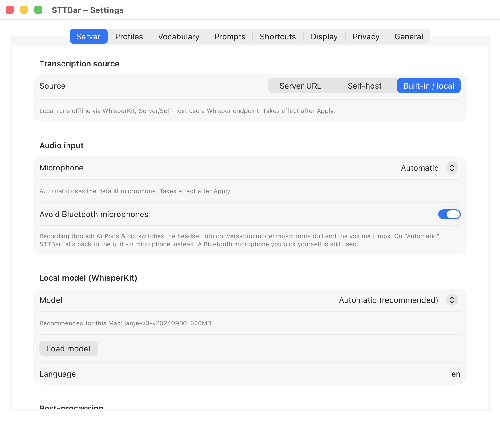
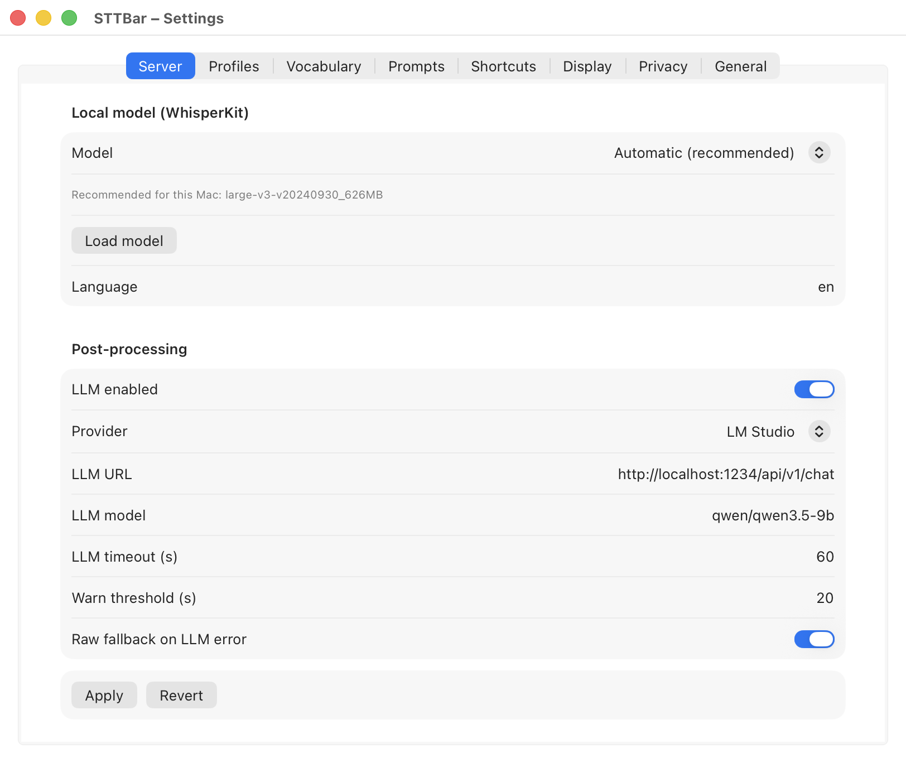
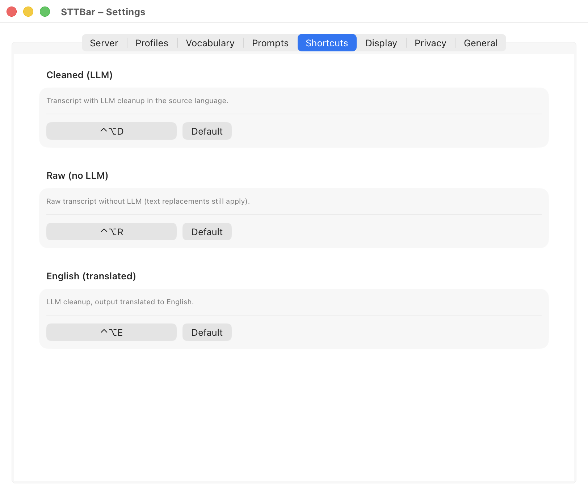
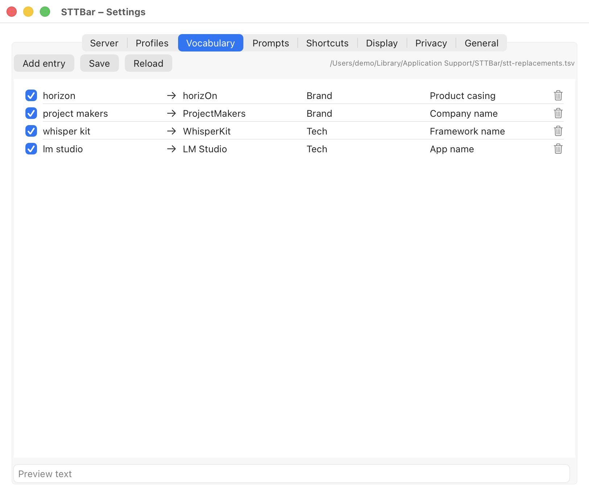

<p align="center"></p>

# STTBar

**Talk instead of type. Anywhere on your Mac.**

STTBar is a native macOS menu-bar app that turns your voice into clean,
ready-to-paste text. Press a global hotkey, speak, press again: your words are
transcribed with Whisper, optionally polished by an LLM, and pasted straight
into whatever app has focus. No browser tab, no account, no subscription.

## Why STTBar

Typing is the bottleneck. Whether you are prompting an AI assistant, answering
a customer, or drafting documentation, speaking is several times faster than
typing. STTBar removes every step between your thought and the text field: one
hotkey to start, one to stop, and the finished text appears at your cursor.

It was born from a very practical need: dictating long, structured prompts to
coding agents without touching the keyboard. That is why STTBar ships with
agent-ready cleanup prompts that turn rambling speech into precise, structured
instructions, in German or with English output.

Your audio stays under your control. Run everything on-device with WhisperKit,
point STTBar at your own self-hosted Whisper server, or use any
Whisper-compatible API. Fully offline operation is a first-class setup, not an
afterthought.

## How it works

1. **Press your hotkey.** A compact HUD with a live waveform appears and
   STTBar starts recording.
2. **Speak.** Say what you want to write: a prompt, an email, a commit
   message, a support reply.
3. **Press again.** Whisper transcribes, the optional LLM pass strips filler
   words and tightens the structure, and the result lands in the focused app.

## Screenshots

<p align="center">
  <picture><source media="(prefers-color-scheme: dark)" srcset="docs/screenshots/hud-recording-dark.png"></picture>
  <picture><source media="(prefers-color-scheme: dark)" srcset="docs/screenshots/hud-cleanup-dark.png"></picture>
</p>

<table>
  <tr>
    <td><picture><source media="(prefers-color-scheme: dark)" srcset="docs/screenshots/settings-transcription-dark.png"></picture></td>
    <td><picture><source media="(prefers-color-scheme: dark)" srcset="docs/screenshots/settings-llm-cleanup-dark.png"></picture></td>
  </tr>
  <tr>
    <td><picture><source media="(prefers-color-scheme: dark)" srcset="docs/screenshots/settings-hotkeys-dark.png"></picture></td>
    <td><picture><source media="(prefers-color-scheme: dark)" srcset="docs/screenshots/settings-vocabulary-dark.png"></picture></td>
  </tr>
</table>

## Features

- Three dictation modes on separate global hotkeys: full cleanup, raw
  transcript, and English output (speak German, paste English).
- Transcription your way: fully on-device with WhisperKit (model
  recommendations matched to your Mac's RAM), self-hosted via the included
  Docker Compose file, or any Whisper-compatible endpoint.
- Optional LLM cleanup via LM Studio or any OpenAI-compatible chat endpoint.
  If the LLM is unreachable, STTBar falls back to the raw transcript instead
  of failing the dictation.
- Built-in Agent V4 prompt presets for German and English-output workflows,
  plus a full prompt editor with profiles for your own presets.
- Live HUD with waveform and phase timeline, so you always see whether STTBar
  is recording, transcribing, or cleaning up.
- Vocabulary replacements that get names, jargon, and product terms right
  every time.
- Transcript history with privacy controls, and a sensitive mode that keeps
  dictations out of history and removes the transcript file after pasting.
- German/English interface switch that also aligns the Whisper language and
  the active prompt.
- Native Swift menu-bar app: fast, small, and quiet. No Electron.

## System Requirements

- macOS 14 Sonoma or later.
- A Mac with Apple silicon for the prebuilt release (it is built for arm64).
- To build from source: Xcode 16 or later (WhisperKit needs the macOS 15 SDK).
- Optional: a Whisper-compatible server instead of on-device transcription,
  and an LM Studio or OpenAI-compatible endpoint for the LLM cleanup.

## Install

### Download the release (recommended)

1. Download `STTBar.app.zip` from the
   [latest release](https://github.com/ProjectMakersDE/STTBar/releases/latest).
   The app is signed with a Developer ID and notarized by Apple.
2. Optional: compare the checksum with `STTBar.app.zip.sha256` from the same
   release:

   ```bash
   shasum -a 256 STTBar.app.zip
   ```

3. Unzip the file and move `STTBar.app` to `/Applications`.
4. Open STTBar. Allow microphone access when asked, and enable STTBar under
   System Settings > Privacy & Security > Accessibility so it can paste the
   text into the focused app.

### Build from source

```bash
git clone https://github.com/ProjectMakersDE/STTBar.git
cd STTBar
bash install.sh
```

The installer builds `STTBar.app`, installs it to `/Applications` when
possible, copies the backend scripts to `~/.local/share/stt`, and starts the
LaunchAgent.

## Configure

Open the menu-bar microphone icon and choose `Settings…` (`Einstellungen…`).
Use the `Language` / `Sprache` switch (menu bar or General tab) to run the whole
app in German or English.

Key settings:

- Whisper URL, for example `http://localhost:8082/v1/audio/transcriptions`.
- Whisper model, for example `Systran/faster-whisper-large-v3-turbo`.
- Optional LLM cleanup URL, model, provider, and timeout.
- Prompt presets and active prompt.
- Hotkeys and HUD position.

The app stores these values in its sandbox container:
`~/Library/Containers/de.projectmakers.sttbar/Data/Library/Application Support/STTBar/.env`.

## Local Whisper Server (NVIDIA GPU only)

The included `docker-compose.yml` starts a Speaches/faster-whisper server from
the CUDA image and reserves one NVIDIA GPU. It needs a host with an NVIDIA GPU
and the NVIDIA Container Toolkit, so it does not run on a Mac. On a Mac, use the
on-device WhisperKit transcription instead.

```bash
docker compose up -d
```

Set `STT_DOCKER_PORT` and `STT_MODEL` in `.env` if needed, then set the Whisper
URL in STTBar to `http://your-whisper-host:8082/v1/audio/transcriptions`.

## Updates

Every `feat`, `fix` or `perf` commit on `master` publishes a GitHub Release with `STTBar.app.zip`,
`stt-scripts.zip`, and matching SHA256 files. To update, either download the
latest release and replace `STTBar.app`, or pull the repository and rerun the
installer:

```bash
git pull
bash install.sh
```

Your configuration in the app container is not touched by updates.

## Development

```bash
swift test --package-path macos-app
for t in tests/*.sh; do bash "$t"; done
bash macos-app/build-app.sh /tmp/sttbar-build-check
```

Releases use Conventional Commits and Semantic Release on `master`.

## Privacy

STTBar has no account, no analytics and no tracking. Audio and text stay on your Mac unless you
enter your own Whisper server or LLM endpoint. Details: [Privacy Policy](PRIVACY.md).

## Support

Questions and bug reports: [GitHub Issues](https://github.com/ProjectMakersDE/STTBar/issues).

## License

STTBar is free to use and its source code is public, under the
[PolyForm Shield License 1.0.0](LICENSE). You may use it at home and at work,
build it yourself, change it and share copies together with the license.
You may not sell STTBar or offer it, or a version built from it, as a product
that competes with STTBar, even for free.

This makes STTBar source-available rather than open source in the OSI sense.
